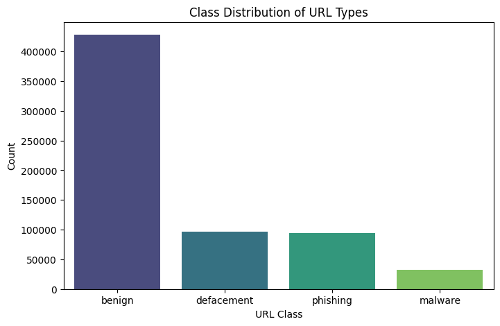
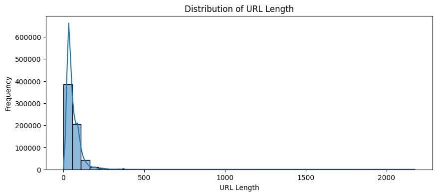
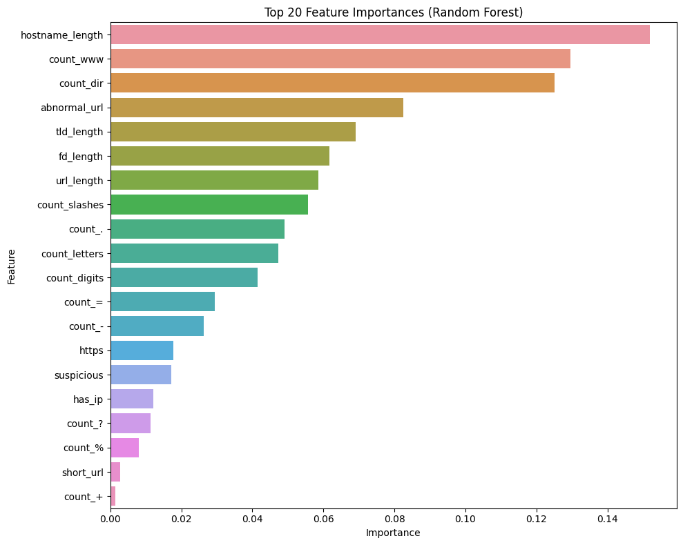
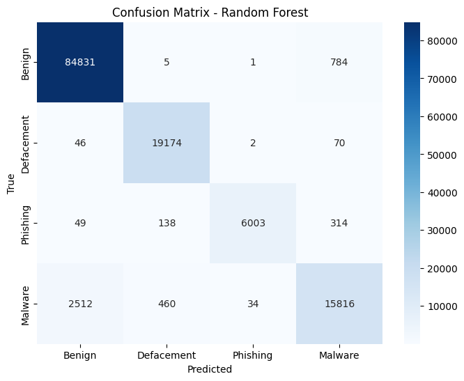
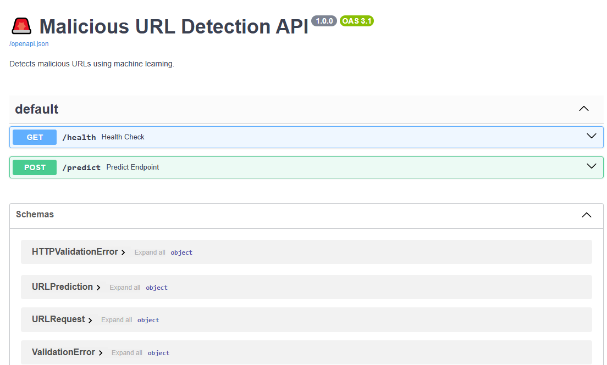

# 📘 Malicious URL Detection Using Machine Learning

A production-ready machine learning project for detecting malicious URLs using lexical and domain-based features, served via a FastAPI inference service, with a clean training pipeline, feature engineering module, tests, and reproducible environment.

## 🛑 Problem Statement

Malicious URLs are widely used for:

- Phishing
- Malware distribution
- Defacement
- Credential harvesting

Manually detecting harmful links is slow and unreliable.  
This project builds a machine learning classifier that automatically predicts whether a URL is:

- Benign
- Defacement
- Malware
- Phishing

### The solution includes:
- Feature engineering on URLs (length, domain, special chars, suspicious keywords,…)
- A trained Random Forest model
- A FastAPI server providing `/predict` endpoint
- Automated tests with pytest
- Docker support
- Clean, modular project structure

## 📁 Dataset Description

**Source:** [Kaggle — Malicious URL Dataset](https://www.kaggle.com/datasets/sid321axn/malicious-urls-dataset)  
**Samples:** 651,191 URLs  
**Columns:**

- `url` — the raw URL
- `type` — class label (benign/defacement/phishing/malware)

### Class Distribution
| Class       | Percentage |
|-------------|------------|
| Benign      | 66%        |
| Defacement  | 15%        |
| Phishing    | 14%        |
| Malware     | 5%         |

This imbalance is moderate; therefore, **macro F1** is used for evaluation.

## 🔬 Exploratory Data Analysis (Summary)

Key observations:

- Malicious URLs often contain:
  - Suspicious keywords ("login", "verify", "paypal", "secure"…)
  - Longer paths, more special characters
  - Embedded subdomains
- Benign URLs tend to be shorter and cleaner.
- HTTPS is **not** a reliable indicator of safety (many malicious URLs also use it).

## 🧠 Modeling Approach

### Feature Engineering
Extracted from the raw URL:

- URL length, hostname length
- Number of digits, letters
- Counts of special characters (`@`, `?`, `=`, `$`, `!`, `//`…)
- HTTPS flag
- Suspicious keywords
- Directory counts
- TLD length
- URL shortening service flag
- IP-based URL flag

These features are generated via:
```python
src/features/feature_engineering.py
```

### Model Used
A `RandomForestClassifier` with tuned hyperparameters:

```json
{
  "max_depth": 20,
  "min_samples_leaf": 1,
  "min_samples_split": 2,
  "n_estimators": 160
}
```

## 📊 Model Performance

| Metric        | Score |
|---------------|-------|
| Accuracy      | ~0.97 |
| Precision     | ~0.97 |
| Recall        | ~0.94 |
| F1-Score      | ~0.95 |

**Macro-F1** used to handle class imbalance.

## 🏗️ System Architecture

```
        ┌────────────┐
        │  Dataset   │
        └─────┬──────┘
              │
              ▼
     ┌──────────────────┐
     │ Feature Engineering│
     └──────┬───────────┘
            │
            ▼
   ┌──────────────────┐
   │  ML Model (RF)   │
   └──────┬───────────┘
          │   best_model.pkl + label_encoder.pkl
          ▼
   ┌──────────────────┐
   │   FastAPI Server │
   │  (/predict)      │
   └──────────────────┘
```
---
## 📓 Jupyter Notebook: Full EDA & Experiments

The project's foundation was built in this interactive **Kaggle Notebook**, where we performed comprehensive **Exploratory Data Analysis (EDA)**, feature engineering experiments, baseline modeling, and hyperparameter tuning trials.

**[Open Notebook on Kaggle](https://www.kaggle.com/code/alyalsayed/malicious-url-detection)**  
*(Fork it, run it, and experiment! No setup required — datasets and environment are pre-loaded.)*


## Project Structure

```plaintext
Malicious-URL-Detection/
│
├── src/
│   ├── api/
│   │   └── serve.py                  # FastAPI inference server (/predict)
│   │
│   ├── data/
│   │   └── data.zip                  # Raw dataset (Kaggle)
│   │
│   ├── features/
│   │   └── feature_engineering.py    # Extracts 30+ lexical & structural features
│   │
│   ├── inference/
│   │   └── predict.py                # Loads model + encoder, returns prediction
│   │
│   ├── models/
│   │   ├── best_model.pkl            # Trained RandomForest model
│   │   ├── label_encoder.pkl         # Label encoder (benign → 0, etc.)
│   │   └── model_metadata.json      # Hyperparams, label mapping, training info
│   │
│   └── training/
│       └── train.py                  # Full training pipeline (with caching)
│
├── notebooks/
│   └── notebook.ipynb                # Exploratory Data Analysis & experiments
│
├── tests/
│   ├── test_api.py                   # FastAPI endpoint tests
│   └── test_features.py              # Feature engineering unit tests
│
├── Dockerfile                        # Multi-stage build for lightweight image
├── requirements.txt
├── README.md
└── .gitignore
```
## Model Comparison Results

We evaluated **8 different algorithms** on the same train/test split (80/20) using **macro-averaged metrics** to fairly handle class imbalance.

**Best model (highest Macro F1)** → **Random Forest**

| Rank | Model              | Accuracy | Precision (macro) | Recall (macro) | **F1 Score (macro)** |
|------|--------------------|----------|-------------------|----------------|----------------------|
| **1**    | **Random Forest**      | **0.9637**   | **0.9640**            | **0.9304**         | **0.9459** |
| 2    | XGBoost                | 0.9605   | 0.9557            | 0.9255         | 0.9396 |
| 3    | Decision Tree          | 0.9587   | 0.9498            | 0.9227         | 0.9353 |
| 4    | Gradient Boosting      | 0.9449   | 0.9287            | 0.8867         | 0.9055 |
| 5    | Extra Trees            | 0.9356   | 0.9339            | 0.8605         | 0.8892 |
| 6    | SGD Classifier         | 0.8551   | 0.7736            | 0.7586         | 0.7471 |
| 7    | Gaussian NB            | 0.8231   | 0.7345            | 0.7389         | 0.7127 |
| 8    | AdaBoost               | 0.5927   | 0.7389            | 0.7029         | 0.6458 |

**Winner: Random Forest** — selected for production due to:
- Highest macro F1 score (**0.9459**)
- Excellent balance of performance and interpretability
- No need for feature scaling
- Robust to overfitting with proper tuning

## 📊 Visualizations & Results

### 1. Class Distribution

*Benign URLs dominate (~66%), with phishing and defacement being the most common malicious types.*

### 2. Distribution of URL Length by Class

*Malicious URLs (especially phishing & defacement) tend to be significantly longer than benign ones.*

### 3. Top 20 Feature Importances – Random Forest

*Key indicators: presence of suspicious keywords, URL length, number of subdomains, special characters, etc.*

### 4. Confusion Matrix – Final Random Forest Model (Test Set)

*Excellent performance across all classes — very few false negatives on malware and phishing.*

### 5. FASTAPI Swagger


### 6. API Request health Example


### 7. API Request predict Example

*Real-time prediction with class probabilities returned in < 10ms.*

---

**All visualizations were generated using Matplotlib, Seaborn, and FastAPI Swagger UI screenshots.**

## 🚀 How to Run Locally

1️⃣ **Create and activate a virtual environment**

```bash
python3.11 -m venv venv
source venv/bin/activate      # macOS/Linux
# or
venv\Scripts\activate         # Windows
```

2️⃣ **Install dependencies**

```bash
pip install -r requirements.txt
```

3️⃣ **Run training (optional)**

```bash
python -m src.training.train
```

This will:
- Generate `best_model.pkl`
- Generate `label_encoder.pkl`
- Create `model_metadata.json`

*If the model already exists, training is skipped.*

4️⃣ **Start FastAPI server**

```bash
python -m src.api.serve
```

Server will run at: http://localhost:8000

## 🧪 Testing

Run the full test suite:

```bash
pytest
```

Run one test file:

```bash
pytest tests/test_api.py -vv
```

## 🌐 API Usage Example

**POST** `/predict`

**Request:**
```json
curl -X POST http://localhost:8000/predict \
  -H "Content-Type: application/json" \
  -d '{"url": "signin.eby.de.zukruygxctzmmqi.civpro.co.za"}'

```

**Response:**
```json
{
  "input_url": "signin.eby.de.zukruygxctzmmqi.civpro.co.za",
  "predicted_class": "phishing",
  "class_id": 3,
  "probabilities": {
    "benign": 0.18,
    "defacement": 0.04,
    "malware": 0.07,
    "phishing": 0.70
  }
}
```

## 🐳 Running with Docker

**Build the image:**

```bash
docker build -t url-detector .
```

**Run container:**

```bash
docker run -p 8000:8000 url-detector
```

## 🛠️ Next Steps

- Add model monitoring + drift detection
- Create a web UI dashboard
- Support batch predictions
- Deploy with Docker + K8s + CI/CD

---

